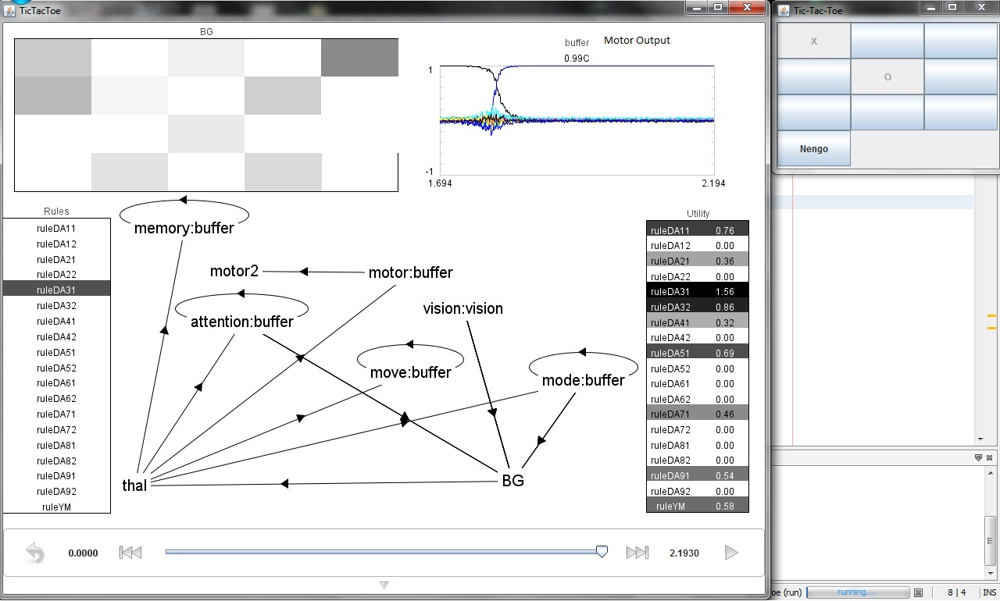

Tic tac toe in Nengo
====================

The motivation for this project came from last year when we tried to
build a spiking neural network that can play hearts (card game). Then
we did not have a framework like Nengo to work on so we had to build
everything from scratch. This year since we had the Nengo framework, I
wanted to try the project again. I talked to Chris about building a
game and especially a Hearts game, he encouraged me saying it can be
done but it will be difficult to build. He suggested we should start
with something smaller maybe like comparing cards or something. We
settled on Tic Tac Toe. It is a small enough game with few basic
rules. This seemed like a problem that can be tackled during the
Telluride workshop.

Here's a video of the model running:
http://youtu.be/lBNZIO1JxXs

A basic implementation of the game was done in JAVA for 2 human
players. It had a command line output. The files can be found in this
repository.  Further a GUI interface with the Tic Tac Toe grid board
was added and the second human player was replaced with a computer
program making the moves. The idea was to replace this computer player
with the Nengo engine.

The basic strategy while building the Nengo engine was three fold. In
order to make it easy to understand, let us assume the cue for the
computer is 'O' and the human is 'X'.

1. Win: The first thing to look for is a win. If you have 2 'O'
   already in a row/column/diagonal and there is a blank square in the
   same row/column/diagonal then place the cue and win the board. So
   the idea is to scan for winning combinations and make the winning
   move.
2. Block: The next strategy is to look to block the winning
   combinations of the opponent. If you have 2 'X' already in a
   row/column/diagonal and there is a blank square in the same
   row/column/diagonal then place the cue and block it. The idea is to
   scan for losing combinations and make the blocking move.
3. Intelligent Move: If it is neither a winning move or a blocking
   move, the we make an "intelligent" move. This was first
   experimented with being finding the first empty square and placing
   a cue. The the squares were prioritized depending upon the
   locations. The center squares got the highest priority, then the
   corners and then the other 4 squares. So if the center square is
   not occupied we go ahead and place the cue there, else we move on
   to the corners and then to the rest. Even though tic tac toe is
   simple game, it is really complex to construct winning situations
   for the program. We as humans can play some complex moves which
   will construct into winning positions over time but planning ahead
   was not considered for the implementation.

Also an important thing to note is that the system does not learn over
time to make better moves. It has a set of rules it follows and it
will come up with same moves if presented with the same situation
again (even if it lost earlier in the given situation). The system
needs to be told about the rules. Just like we as humans need to know
the basic rules for playing a game, however we can learn new
strategies over time. It would be good to include this kind of
learning in the next version.

## Results

The Tic Tac Toe engine running on Nengo was demonstrated at the final
presentation of the workshop. A video of the demo is linked above.
The image below shows the Nengo network, the basal ganglia output
(which decides which rule wins), the motor output which is the play
suggested by nengo engine depending upon the current board
situation. The image also shows the Tic Tac Toe grid board on the
right. The "Nengo" button is used to get the output from the nengo
engine. The other player can just click on the particular grid square
he wants to place his cue on.

The `TicTacToe.py` file contains the rules and modules for
implementation. The `Source` folder contains the Java class files.

In order to run the project, create a Java project and add the class
files. Also include the libraries from Nengo to the project. Put the
`TicTacToe.py` file in the java classpath. When you the run the main
function from Java it should create the Nengo network and open up 2
windows. One of them is the tic tac toe grid board and the other is
the Nengo simulation window.

`TicTacToe.py` contains simple basic rules to make an "intelligent
move". The file `TicTacToeFull.py` contains the full rules. The full
rules were not used because it takes a lot of time for the rules to
converge while running on a laptop and real time demo could not be
made.
